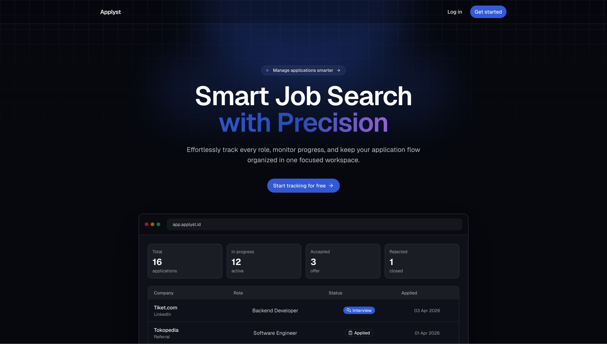
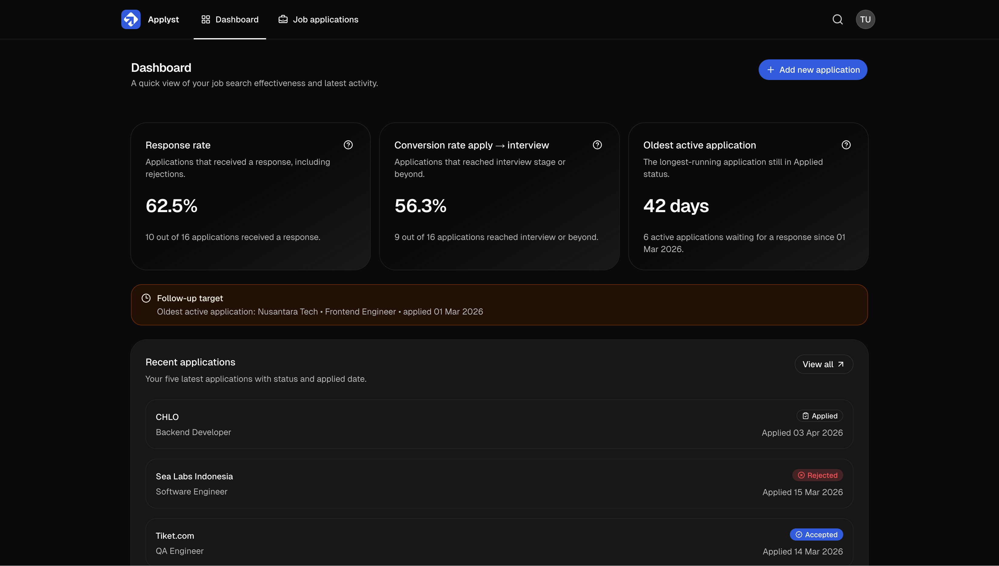
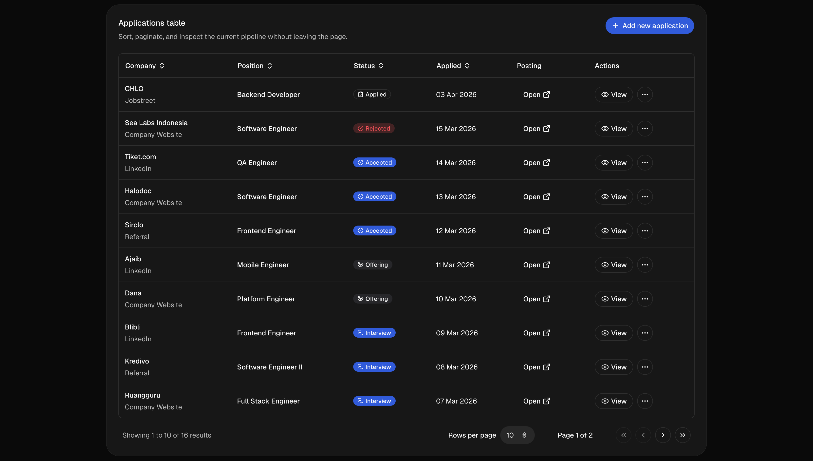
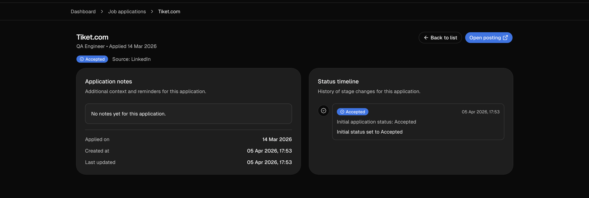

# applyst

applyst is a Laravel + Inertia + React application for tracking job applications, monitoring job search effectiveness, and keeping follow-ups organized.

## Features

- Track job applications in one place
- Measure response rate and conversion rate
- Monitor the oldest active application for follow-up timing
- Review recent applications from the dashboard
- Manage application status changes with history

## Tech Stack

- Laravel 13
- Inertia.js v3
- React 19
- TypeScript
- Tailwind CSS v4
- Wayfinder
- Fortify

## Requirements

- PHP 8.4+
- Node.js 22+
- Composer
- MySQL or another supported Laravel database

## Setup

1. Install PHP dependencies:

    ```bash
    composer install
    ```

2. Install JavaScript dependencies:

    ```bash
    npm install
    ```

3. Create your environment file if needed:

    ```bash
    cp .env.example .env
    ```

4. Generate the application key and run migrations:

    ```bash
    php artisan key:generate
    php artisan migrate
    ```

5. Start the app:

    ```bash
    composer run dev
    ```

## Available Scripts

### Composer

- `composer run dev` - start the Laravel server, queue listener, logs, and Vite dev server
- `composer test` - clear config, run Pint checks, then run the test suite
- `composer lint` - run Pint in parallel
- `composer lint:check` - check Pint without fixing
- `composer ci:check` - run frontend checks and tests together

### npm

- `npm run dev` - start Vite
- `npm run build` - build the frontend
- `npm run build:ssr` - build the frontend and SSR bundle
- `npm run format` - format frontend and root config files
- `npm run format:check` - check formatting
- `npm run lint` - run ESLint with fixes
- `npm run lint:check` - run ESLint without fixes
- `npm run types:check` - run TypeScript checks

## Quality Hooks

The repository uses Lefthook for local checks.

- Pre-commit: Prettier, ESLint, TypeScript, and Pint checks
- Pre-push: test suite

## Project Structure

- `app/` - Laravel application code
- `resources/js/` - React pages, components, routes, and feature modules
- `routes/` - Laravel routes
- `tests/` - PHPUnit feature and unit tests

## Screenshots

### Landing Page



First impression of applyst and its core value for job tracking.

### Dashboard



Overview of key metrics, response rate, and recent progress.

### Applications List



Centralized table to browse, filter, and monitor all applications.

### Application Detail



Detailed timeline and status history for each application.

### Reminders


Follow-up reminders to keep applications moving forward.

## Notes

- The app name is configured as `applyst`.
- Dashboard metrics focus on effectiveness, not just total application counts.
- Use Wayfinder-generated route helpers from `resources/js/routes/` for frontend navigation.
